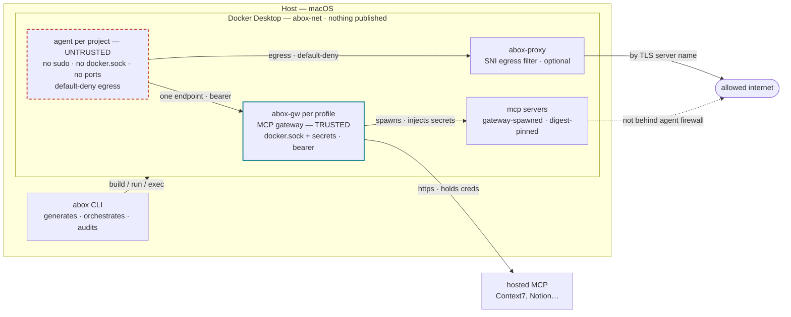

# abox — Complete Guide

The full reference for abox: every setting, every hardening, and how to add each
kind of MCP server — including self-hosted custom images end to end.

For a five-minute path from nothing to a running agent, read
**[QUICKSTART.md](QUICKSTART.md)** first. For the one-page overview and the
rationale behind the design choices, read **[README.md](README.md)**. This
document is the deep reference that sits under both.

---

## Contents

1. [What abox is, and the threat model](#1-what-abox-is-and-the-threat-model)
2. [Architecture](#2-architecture)
3. [Installation & prerequisites](#3-installation--prerequisites)
4. [The security model — invariants & hardenings](#4-the-security-model--invariants--hardenings)
5. [Global configuration — `config.yaml`](#5-global-configuration--configyaml)
6. [The project manifest — `agentbox.yaml`](#6-the-project-manifest--agentboxyaml)
7. [MCP servers — the three kinds](#7-mcp-servers--the-three-kinds)
   - [7.1 Catalog servers](#71-catalog-servers)
   - [7.2 Remote / hosted servers](#72-remote--hosted-servers)
   - [7.3 Custom image servers (self-hosted)](#73-custom-image-servers-self-hosted)
8. [Secrets](#8-secrets)
9. [Egress control](#9-egress-control)
10. [Toolchains](#10-toolchains)
11. [Filtering command output (rtk)](#11-filtering-command-output-rtk)
12. [Running: up, run, shell, lifecycle](#12-running-up-run-shell-lifecycle)
13. [`abox doctor` — every check](#13-abox-doctor--every-check)
14. [State on disk](#14-state-on-disk)
15. [Command reference](#15-command-reference)
16. [Troubleshooting](#16-troubleshooting)

---

## 1. What abox is, and the threat model

`abox` is a host-side macOS CLI that provisions **disposable, network-restricted
Claude Code environments**, one per project, with MCP access exclusively through
a Docker MCP Gateway.

The governing assumption is that **the agent is untrusted.** It executes
model-influenced instructions, including whatever arrives through files, tool
output, and web content — prompt injection is in scope, not an edge case. abox
does not try to make the agent safe; it limits the blast radius if the agent
does something hostile, across four axes:

The adversary is **whoever controls the model's output** — via an injection in a
file the agent read, a poisoned page, a hostile tool result, or a bad day. Assume
they can run any command the agent can run and call any tool the agent has. The
question is not whether that happens; it is how far it gets.

### In scope — what that adversary cannot do

| Axis | Cannot |
|---|---|
| **Filesystem** | read masked paths, write outside the workspace and its own containers, or modify the artifacts that define its sandbox |
| **Network egress** | reach a host that is not allowlisted, resolve a name that is not allowlisted, or reach a *different* host at an allowed address (with the SNI proxy on) |
| **Credentials** | obtain a secret abox did not explicitly attach, or reach the Docker daemon from its own container |
| **Execution** | become root, keep anything running after the container exits, or open a port anything can connect to |

Every one of those is enforced and mechanically checked — §4 names the `abox
doctor` check per row, and [SECURITY.md](https://github.com/tr0mb1r/abox/blob/main/SECURITY.md)
names the test per row.

### Out of scope — non-goals

- **Preventing prompt injection.** abox assumes it succeeds. Nothing here makes
  the agent harder to manipulate; it limits what a manipulated agent reaches.
  Treating injection as an edge case to be filtered out is how sandboxes end up
  defending a boundary that was never the real one.
- **Host compromise via Docker Desktop itself.** A container escape, a daemon
  vulnerability, or a hostile Docker Desktop update is outside what a CLI that
  drives that daemon can defend against.
- **Malicious packages from allowlisted registries.** Allowlisting `pypi.org`
  means the agent can install anything on PyPI, and it runs with the agent's
  privileges inside the sandbox. Pinning images does not pin what a build pulls.
- **Protecting the workspace from the agent.** `/workspace` is a read-write bind
  of your real files, deliberately. If you want the agent unable to touch your
  code, this is the wrong tool.
- **Multi-tenancy.** One person's projects on one Docker host. abox does not try
  to isolate you from yourself.

### Residual risks

Known, unfixed, and enumerated here so a skeptical reader does not have to
reconstruct them from asides scattered through sixteen sections. `abox doctor`
states each on every run.

| Risk | Why it stands | Where |
|---|---|---|
| **MCP tool egress bypass** | server containers are not the agent, so they are outside the firewall, the SNI proxy and the scoped resolver at once | §7.0 |
| **The gateway is trusted code** | the agent holds a bearer token for a container that mounts `docker.sock`; one parsing bug there is root-equivalent | §4 |
| **The agent holds a Claude credential** | the `~/.claude` volume is readable by it and exfiltrable to any allowed domain; there is no opting out | §8 |
| **`/workspace` is live** | files written there execute elsewhere later — CI, `make`, `npm install`, an editor | §6 |
| **Attached secrets** | `secrets attach` hands the agent a value it can read and transmit | §8 |
| **The SNI proxy answers the whole bridge** | any container without the agent firewall can relay through it to that project's allowlist | §9 |
| **Shared CDN addresses** | ipset mode matches IPs, so one allowlisted domain allows everything else at those addresses; the SNI proxy closes it | §9 |

Everything below is in service of the four axes. When a feature weakens one of
them, abox says so on every run rather than hiding it.

### Where abox sits among the alternatives

abox adds exactly three things over its nearest neighbours: **MCP mediated
through one authenticated endpoint**, **the egress review queue as a produced
artifact**, and **per-turn tool cost measurement**. Everything else it does,
something simpler already does.

| You want | Use | Why not abox |
|---|---|---|
| guardrails on Bash inside a normal session | **Claude Code's own sandbox** — Seatbelt on macOS, bubblewrap + socat on Linux/WSL2, configured via `/sandbox` or `settings.json` | abox does not constrain commands *inside* the container at all. Its container is the boundary; within it the agent runs freely by design. The two compose — run both |
| one repo, one container, editor-native | **[Anthropic's reference dev container](https://github.com/anthropics/claude-code/tree/main/.devcontainer)**, which this project's `init-firewall.sh` descends from | it is simpler, official, and has no CLI to install. abox is that plus a lifecycle across many projects |
| a real syscall boundary | **gVisor, Firecracker, a VM** | abox drives Docker Desktop and inherits whatever its isolation is worth. Container escape is a stated non-goal. abox is a policy layer and would sit happily on top of a stronger primitive |
| many projects, MCP behind one authenticated endpoint, an audit you can read | **abox** | — |

Two specifics worth stating rather than implying: Claude Code has no built-in
proxy or unified auth layer for MCP — servers are dialled directly and
credentials travel in headers or the environment — and it does not document a
per-tool token breakdown or a log of blocked egress for review. Those absences
are the gap abox fills, and they are a narrower gap than "sandboxing".

---

## 2. Architecture



The same topology as text, with the exact mounts and ports:

```
Host (macOS)
├── Docker Desktop (MCP Toolkit)
│   ├── network: abox-net              user bridge, nothing published anywhere
│   ├── abox-gw-<profile>              docker/mcp-gateway@sha256:… (digest-pinned)
│   │     ├─ mounts /var/run/docker.sock
│   │     ├─ --transport=streaming --port=<profile port> --host=0.0.0.0
│   │     └─ bearer token, minted per profile by abox
│   ├── mcp/<server> containers        spawned by the gateway, digest-pinned
│   ├── abox-proxy-<project>           nginx, optional — SNI-filtered egress
│   └── agent-<project>-<runid>        ephemeral; the agent + Claude Code
│         RW  /workspace               your project, bind-mounted
│         RO  /opt/abox                firewall script + mcp.json (agent can't edit)
│         RO  /context/*               declared read-only context dirs
│         RO  masked paths             empty overlays over .env* and friends
│         VOL abox-claude-<hash>       ~/.claude auth + session state, per project
└── abox (Python CLI)                  generates, orchestrates, audits
```

**One gateway per profile.** Multiple projects that share a profile share its
gateway; abox reconciles the union of what they each declare. The agent reaches
`http://abox-gw-<profile>:8811/mcp` by container DNS on `abox-net`. Nothing is
ever published to the host or the LAN.

**The gateway is the trusted component.** It holds the Docker socket and the
secrets; it runs only the servers abox writes into its catalog. The agent holds
neither.

**Two containers, two jobs.** MCP servers run in the *gateway's* containers, not
the agent's. That is why an MCP server's network and filesystem access are
governed by the gateway, not by the agent's firewall — a distinction that
matters for "boundary-spanning" servers (§7.3, §13).

---

## 3. Installation & prerequisites

**Host prerequisites — the whole list:**

- **macOS with Docker Desktop ≥ 4.48**, MCP Toolkit enabled.
- **`op`** (1Password CLI) — *optional*, only if a secret points at `op://…`.

**Linux and colima are not supported yet.** What abox actually needs is the
`docker mcp` CLI plugin, which is buildable anywhere — Docker Desktop is just
the easy way to get it on macOS. But at least one security claim changes off
Desktop: secrets fall back from the OS keychain to a `.env` file on disk.

The suite itself, though, runs on Linux.
`.github/workflows/ci.yml` runs the unit tests on `ubuntu-latest` under 3.12 and
3.13; `.github/workflows/linux-docker.yml` runs `uv run pytest -m docker` there
against a live daemon. Both pass — but only after Linux showed two controls to
be absent that macOS reported as present: IPv6 egress was unrestricted, because
an unconfigured `ip6tables` defaults to policy ACCEPT and nothing set it (§9),
and `.abox` was mode 0700 owned by the host user, which Docker Desktop ignores
and Linux enforces, so every container that mounts it got EACCES. A control
tested only where it cannot fail is not tested; SECURITY.md names both.

What remains unmeasured: the `iptables` backend beyond the runner's own kernel —
the image installs `iptables` from apt with no `nft`/`legacy` selection, so
against a distro kernel that disagrees the rules could be accepted and match
nothing; everything past Ubuntu's defaults (SELinux, AppArmor confinement,
`systemd-resolved` on `127.0.0.53`, rootless Docker, Podman); and colima, which
behaves more like Docker Desktop than like Linux, because its bind mounts cross
a filesystem shim.

There is **no npm, no Node, no `@devcontainers/cli`** on the host. abox drives
the Docker CLI directly and bakes Claude Code into the agent image from its
checksum-verified native binary. The only thing that ever installs Node is the
`node` toolchain, and that lands *inside the container* because a project asked
for it.

**Install:**

```bash
uv tool install abox-cli
```

The distribution is [`abox-cli`](https://pypi.org/project/abox-cli/) — the bare
`abox` name on PyPI is held by an unrelated placeholder — and **the command it
installs is `abox`**. To track the repo rather than the last release:
`uv tool install git+https://github.com/tr0mb1r/abox`.

After editing abox's own source, reinstall the checkout in place, from inside
it:

```bash
uv tool install --reinstall --force .
```

**Docker disk.** The first agent build plus a few pre-pulled server images wants
headroom. Give the Docker Desktop VM 40–60 GB (Settings → Resources). A build
that dies mid-way with a disk error is almost always this.

---

## 4. The security model — invariants & hardenings

The table is split deliberately. **Enforced invariants** are the ones something
mechanically verifies, and the last column names what. **Trust assumptions** are
the ones nothing verifies — they are load-bearing all the same, and burying them
in prose would be the dishonest way to present this. `abox run` refuses
`bypassPermissions` if any boundary check fails.

### Enforced invariants

| Invariant | How it is enforced | Verified by |
|---|---|---|
| The agent's runspec mounts no Docker socket | no `docker.sock` bind in the rendered argv | `agent.no-docker-sock`, `boundary.no-docker-sock` |
| The agent publishes nothing | no `-p`/`--publish` in the runspec; the gateway publishes nothing either | `agent.no-published-ports`, `gateway.no-published-ports` |
| The agent is not privileged | no `--privileged` in the runspec | `agent.not-privileged` |
| The agent runs as an unprivileged uid | `--user` in the rendered argv is not root, and `remote_user` refuses root at parse time. Root plus `NET_ADMIN` could flush the firewall and forge the marker that gates `bypassPermissions` | `agent.not-root`, `boundary.agent-not-root` |
| The agent joins an isolated bridge | `--network` in the rendered argv names a user-defined network, never `host`/`none`/`bridge`/`container:` — abox execs the firewall as root, so a shared namespace would land those rules outside the sandbox | `agent.network-isolated`, `boundary.network` |
| Default-deny egress | in-container iptables + ipset; only addresses resolved from the allowlist, on port 443 by default. The script asserts its own rules and leaves a marker `abox run` reads back — no marker, no agent | `boundary.capabilities`, `boundary.firewall-script` |
| Domain-level egress (optional) | the SNI proxy decides by TLS server name, so a shared CDN address grants nothing (§9) | `egress.proxy` |
| Exactly one MCP endpoint | `claude --mcp-config /opt/abox/mcp.json --strict-mcp-config`, bearer-authenticated | `agent.single-mcp-endpoint` |
| The agent cannot rewrite its own sandbox | the firewall script and `mcp.json` are mounted read-only from outside the workspace, and hash-match the manifest | `boundary.artifacts-private`, `artifacts.integrity` |
| The agent cannot escalate | `sudo` is **purged** from the image; abox applies the firewall as root itself, through the socket it already holds | the image build fails if `sudo` is present |
| The agent holds no secret values unless you attach one | secrets go to MCP server containers, not the agent; `secrets attach` is reported on every run | `agent.env-secrets` |
| Every image is digest-pinned | catalog, custom, **and the gateway** | `servers.pinned`, `gateway.image-pinned`, `gateway.image-digest` |
| The audit trail is not agent-writable | `/var/log/abox` is root-owned inside the container and *not* bind-mounted; logs are harvested through the socket at teardown | the runspec carries no bind for it |

### Trust assumptions

| Assumption | What is and is not guaranteed |
|---|---|
| **The gateway is trusted code.** | The agent's own container cannot reach the Docker daemon; that much is enforced above and checked at every run. It is not the whole claim. The agent holds a bearer token for a network-reachable container that *does* mount `/var/run/docker.sock`, so the boundary that actually matters is that no crafted MCP request traverses third-party gateway code to that socket. One parsing bug there is root-equivalent on the host. abox pins the gateway by digest and verifies the running container against that pin (§4 hardenings, `abox gateway update`); it does not audit the gateway's code, and cannot. |
| **The Docker daemon keeps secret values out of the gateway process.** | abox never writes a secret value into the gateway's environment — it emits `se://docker/mcp/<name>` references that the daemon resolves from the OS keychain when it starts a server container. That the daemon then hands the value only to the intended container is the daemon's guarantee. abox can check that no value passes through its own hands; it cannot check the daemon's. |
| **Hosted MCP servers are dialled by the gateway, not the agent.** | This is why a remote server adds no endpoint and no egress to the agent — and it holds only because the gateway makes the call. The single-endpoint half is enforced; the "the gateway holds the credential" half is a property of the gateway. |
| **MCP server containers are unconstrained on the network.** | They run on `abox-net` with normal egress and Docker's default resolver, outside the agent's firewall, the SNI proxy, and the scoped DNS simultaneously. A tool call carrying a URL reaches that URL. Confirmed by capturing what the gateway actually spawns: every server container runs with `NetworkMode=abox-net` and no scoped resolver. |

### Hardenings in depth

- **No sudo.** The agent image is built with `sudo` purged (`SUDO_FORCE_REMOVE`
  plus explicit removal), and the Dockerfile asserts `! command -v sudo` and
  that dpkg no longer lists it. A present-but-neutered setuid binary is one
  config mistake from working again; abox removes it. The firewall still needs
  root — abox runs `init-firewall.sh` as root itself, through the Docker socket
  it holds on the host, so the agent never needs a path to root.

- **Firewall proven live, not assumed.** `init-firewall.sh` writes a marker into
  the (non-mounted) log dir. `abox run` reads that marker back through the
  socket; **no marker, no agent.** A container whose `postStart` silently failed
  looks identical from the host to one where it worked — this check is why that
  can't pass unnoticed.

- **Artifacts outside the workspace.** The authoritative artifact is
  `runspec.json` in the per-project state dir — the literal `docker run` argv
  abox executes. `.devcontainer/` in your repo is a *review copy*: readable,
  diffable, committable, and never read back. An agent that rewrites the
  firewall script in the workspace changes nothing except a `doctor` finding.

- **Root-owned audit trail.** Docker Desktop does not enforce uid or mode on a
  bind mount, so a shared log dir would let the agent truncate `dns.log` and with
  it the egress review queue. The log dir is container-internal, root-owned,
  `0755`, and copied out at teardown.

- **Scoped DNS.** dnsmasq is the container's only resolver and forwards only
  allowlisted names, returning NXDOMAIN for everything else. Arbitrary resolution
  is a covert channel that survives default-deny egress, because the query name
  itself carries data; scoping closes it. Refused lookups are still logged, so
  the review queue keeps working.

- **Digest pinning & signatures — the honest version.** abox requires catalog
  and custom server images to be digest-pinned, and runs the gateway with
  `--verify-signatures`. But the gateway only signature-verifies images in the
  `docker.io/mcp/*` namespace — a custom or local image is never
  signature-checked regardless. So for a custom image the **digest is the only
  integrity anchor**, which is exactly why `pin: false` (§7.3) is called out as a
  deliberate weakening.

---

## 5. Global configuration — `config.yaml`

Lives at `~/.config/abox/config.yaml` (or `$ABOX_CONFIG_HOME/config.yaml`).
`abox init` scaffolds one with these defaults; every field is optional and falls
back to the value shown.

```yaml
network: abox-net                                   # the user bridge abox creates
gateway_image: docker/mcp-gateway@sha256:54dd518e… # digest-pinned; `abox gateway update` re-resolves it
agent_base_image: mcr.microsoft.com/devcontainers/base:ubuntu
claude_version: latest                              # or an exact x.y.z to pin Claude Code
toolchain_versions:                                 # fetched from upstream tarballs at build
  go: "1.24.5"
  node: "22.14.0"
remote_user: vscode                                 # the unprivileged user in the agent image; root is refused
egress_ports: [443]                                 # ports opened to allowlisted addresses; 80 is opt-in
scoped_dns: true                                    # resolve only allowlisted names (NXDOMAIN else)

agent_env:                                          # env abox sets in the agent to stop it retrying blocked hosts
  DISABLE_AUTOUPDATER: "1"
  CLAUDE_CODE_DISABLE_NONESSENTIAL_TRAFFIC: "1"
  ENABLE_CLAUDEAI_MCP_SERVERS: "false"

rtk:                                                # output-filtering proxy inside the agent (§11)
  enabled: false
  version: "0.43.0"
  repo: rtk-ai/rtk

egress_proxy:                                       # SNI-aware domain-level egress (§9)
  enabled: false
  image: nginx:alpine
  port: 8443
  timeout: 300                                      # idle timeout (s) for a proxied connection

profiles:
  default: { port: 8811 }                           # one gateway per profile; ports must be unique
  # secops: { port: 8812, description: "high-sensitivity" }

defaults:
  mask: [".env*", ".git/hooks"]                     # merged into every project's mask set
  watch:                                            # fingerprinted, not shadowed — see below
    - .github/workflows
    - .gitlab-ci.yml
    - Makefile
    - justfile
    - package.json
    - .pre-commit-config.yaml
    - .vscode/tasks.json
    - .idea
    - "*.code-workspace"
  egress_mandatory:                                 # injected into every project's allowlist
    - api.anthropic.com
    - platform.claude.com
    - claude.ai
    - claude.com
```

**Field notes**

- **`claude_version`** — `latest` fetches the current Claude Code release and
  verifies its published sha256; an exact version pins it. Either way the binary
  goes to `/usr/local/bin`, where the `~/.claude` volume can't shadow it.
- **`agent_env`** — these three switches turn *off* the traffic abox
  deliberately blocks (auto-updater, Datadog telemetry, claude.ai MCP
  connectors), so the agent stops retrying and the review queue stays meaningful.
  Re-enable any of them here **and** add the matching domain to
  `defaults.egress_mandatory`, or the agent will just retry a blocked host.
- **`egress_mandatory`** — `platform.claude.com` is the one people miss: OAuth
  token *refresh* goes there for both claude.ai and Console accounts, so a
  session that works today fails when the token rolls over without it.
- **`profiles`** — a profile is a named gateway on a fixed port. Two profiles may
  not share a port. Projects on the same profile share one gateway container.
  Inventing one from `abox init` (`+ new profile…`) allocates the first free port
  from 8811 up, but writes it here only once the manifest is written — an
  abandoned `init` consumes no port and leaves nothing behind.

Also in `~/.config/abox/`: **`secrets.yaml`** (§8) and **`custom-servers.yaml`**
(§7.3).

---

## 6. The project manifest — `agentbox.yaml`

The manifest is the project's declaration of its sandbox, and the single source
of truth: `abox init` writes it, every other command reads it, and `abox doctor`
validates it against the same schema. Safe to hand-edit.

```yaml
version: 1                          # only 1 is understood
project: demo-app                # lowercase; becomes Docker object names
profile: dev                    # which gateway profile this project uses

servers:                            # catalog + custom-server names (see §7)
  - github-official
  - duckduckgo
  - serena                          # resolved via custom-servers.yaml

remote_servers:                     # internet-hosted, proxied by the gateway (§7.2)
  context7:
    url: https://mcp.context7.com/mcp
    transport: streamable-http      # or: sse
    headers: {}                     # values may use ${ENV} from secrets below
    secrets: []                     # ServerSecret entries the gateway injects
    description: ""

tools:                              # optional per-server allowlist; default = all tools
  github-official: [list_issues, get_file_contents]

toolchains: [python, go]            # installed into the agent image (§10)

mounts:
  mask: [".env*", ".git/hooks", "secrets/"]   # shadow it: the agent cannot read or write it
  watch: ["Makefile", "deploy/"]              # leave it, fingerprint it, report changes
  context: ["~/notes/dev"]                # host dirs mounted read-only at /context/<name>

egress:                             # outbound allowlist (bare hostnames, no scheme/port/path/wildcards)
  - github.com
  - api.github.com
  - pypi.org

env_secrets: {}                     # ENV_VAR: docker-secret-name — hands the AGENT a secret (§8)
egress_ignored: []                  # domains you've decided against; keeps the review queue clean

run:
  permission_mode: bypassPermissions   # default | acceptEdits | bypassPermissions | plan
  output: stream-json                  # stream-json | json | text
  connectors: false                    # allow claude.ai MCP connectors (weakens single-endpoint)
  timeout: 3600                        # wall-clock ceiling per headless run (30..86400 s)
```

**Validation the schema enforces (so `doctor` and `init` agree):**

- `project` / `profile` must be lowercase `[a-z0-9._-]` (they become Docker
  object names). Server names may be mixed case (`SQLite` is a real catalog key).
- `egress` / `egress_ignored` entries are **bare hostnames** — no scheme, port,
  path, or wildcard. Wildcards are rejected because the firewall resolves each
  name into an ipset; every host must be explicit. A domain cannot appear in both
  `egress` and `egress_ignored`.
- `toolchains` must be from the known set (§10).
- `tools:` may only reference declared servers; `remote_servers` names may not
  collide with `servers` names.
- `env_secrets` env var names must be valid and must not shadow a reserved one
  (`PATH`, `HOME`, `CLAUDE_CONFIG_DIR`, `ABOX_*`).
- **`permission_mode: bypassPermissions`** is refused unless the firewall script
  and `NET_ADMIN`/`NET_RAW` are present — the boundary gate. Use it only behind a
  proven sandbox.

You rarely edit this by hand — `abox mcp add`, `abox egress add`, `abox secrets
attach`, etc. all edit it and re-render — but every one of those is just a typed
mutation of this file. Re-running `abox init` is the interactive equivalent: it
opens the review screen on what is already here, and merges rather than replaces,
so fields the picker never asks about (`env_secrets`, `egress_ignored`,
`mounts.watch`, and `remote_servers` together with their tool narrowing) survive
untouched. Everything under `run` *is* asked: the review screen has a row for
each of `permission_mode`, `connectors`, `output` and `timeout`, so those four
come back written from whatever the screen was saved with.

### `mounts.mask` vs `mounts.watch`

`/workspace` is a read-write bind of the real project directory. That is the
point — the agent is there to change your code — and it means the agent can also
write files that cause code to execute **somewhere else, later**: a CI workflow
that runs on the runner, a `Makefile` target that runs on your next `make`, a
`package.json` script that runs on the next `npm install`, an editor task that
runs when someone opens the project. None of those execute in the container, so
none of abox's controls apply to them. A poisoned workflow is a CI compromise on
a delay.

There are two answers, and abox makes you pick per path:

| | `mounts.mask` | `mounts.watch` |
|---|---|---|
| What it does | shadows the path with an empty overlay | leaves the path alone |
| Agent can read it | no | yes |
| Agent can write it | no | yes |
| You find out about a change | there is nothing to find out | `abox doctor` names the file |
| Cost | anything in the workspace that needs the file breaks | detection is after the fact |

Masking is strictly stronger, and masking this whole class outright breaks
ordinary work — you cannot mask `package.json` and still expect the agent to
manage dependencies. So the **defaults watch rather than mask**, and masking
stays one line away for anyone who wants it. A path listed in both is masked
only: the agent cannot reach it, so a change to it is a change abox made, and
reporting that as tampering would train you to ignore the finding.

Watched paths are fingerprinted by sha256 into `git-snapshot.json` alongside the
git-config baseline. Directories are walked, so a workflow added after the
baseline is caught, not just an edited one. Symlinks are recorded by their target
rather than followed — a symlink repointed at another file with identical
contents is exactly the edit this exists to catch, and following it would hide
the swap. Large trees are capped at 500 files per glob, and the check says which
glob it stopped short on rather than quietly reporting less than it checked.

The finding is a warning, not a failure, and that is deliberate: an agent editing
`package.json` is normal work, and a check that fails on normal work is a check
people learn to skip. What it must never do is stay silent.

```
! execution-adjacent files unchanged: changed: .github/workflows/ci.yml
  ↳ these execute outside the sandbox — on a CI runner, on the next build, or
    when an editor opens the project. Read the diff before you push or run
    anything, then `abox doctor --accept-watch` to re-baseline. Add the path to
    `mounts.mask` to stop the agent writing it at all
```

---

## 7. MCP servers — the three kinds

abox starts a project with **nothing**: no servers, no connectors. Everything is
declared explicitly. There are three ways a tool reaches the agent, all through
the one gateway endpoint.

| Kind | Runs where | Declared in | Pin |
|---|---|---|---|
| **Catalog** | a gateway-spawned container | `servers:` | digest, by the catalog |
| **Remote / hosted** | the operator's server, dialed by the gateway | `remote_servers:` | no image; it's third-party |
| **Custom image** | a gateway-spawned container from your image | `servers:` + `custom-servers.yaml` | digest, or `pin: false` |

See what any project actually exposes:

```bash
abox gateway status --tools          # live: every tool the agent will see
abox mcp cost                        # per-turn token cost of that tool set
```

### 7.0 Where a server container sits on the network

Read this before the three kinds, because it applies to all of them and it is
the largest residual risk in the design.

A gateway-spawned server container is **not the agent**. The agent's firewall,
the SNI proxy and the scoped resolver all live inside the agent container, so a
server container is outside all three simultaneously. It runs on `abox-net` with
normal egress and Docker's own resolver. A tool call carrying a URL — `fetch`,
`curl`, a search tool, anything with a URL parameter — reaches that URL. This is
confirmed by capturing what the gateway actually spawns, not inferred from the
design.

The gateway offers no `--network` flag. It applies every network its *own*
container is on to every server it spawns, so this is one lever with a coarse
blast radius, not a per-server dial. There is exactly one per-server setting
Docker enforces:

```yaml
server_network:
  git: none          # → disableNetwork → `docker run --network none`
  serena: none
```

```yaml
# custom-servers.yaml — same thing, declared with the server itself
serena:
  image: serena:local
  pin: false
  network: none
```

`none` is enforced by Docker, not by convention. abox writes it into the catalog
it mounts into the gateway: directly for its own custom servers, and for catalog
servers by re-emitting the upstream entry under the same key with the flag added
(catalogs merge by key, later wins). The gateway logs the overwrite by name and
`abox doctor` reports it, so it is not a silent substitution. The copy is taken
fresh on every render, so it cannot drift further than one `abox up`.

Use it for anything that only touches the filesystem or the repo — `git`,
`filesystem`, an LSP server like Serena. Verified: Serena serves all 22 of its
tools with no network at all.

Two things this does **not** do, stated plainly:

- **A server that needs the internet cannot be constrained.** `brave`,
  `github-official`, `aws-documentation`, `playwright` need egress to be useful,
  and there is no configuration of the current gateway that narrows them while
  keeping them working. `none` makes them useless; nothing else binds. That is a
  residual risk, listed as one.
- **The catalog's `allowHosts` is not a control.** It exists, and on abox's
  topology it is advisory: the gateway keeps the server on its unrestricted
  network and merely *adds* a proxy alongside, which a server is free to ignore.
  It was empirically bypassed during the Phase 0 investigation. abox strips it
  when it renders `disableNetwork`, because Docker refuses to start a container
  asked for both a user-defined and a non-user-defined network mode.

`abox doctor` states the position of every declared server on every run:

```
! MCP server containers are network-constrained as declared: unconstrained
  egress: aws-documentation, brave, context7, github-official, playwright
  (isolated: git, serena)
```

### 7.1 Catalog servers

The Docker MCP Toolkit catalog. Name one and it runs behind the gateway,
digest-pinned and fully logged.

```bash
abox mcp list --all                  # browse the catalog
abox mcp add github-official         # declare it
abox mcp add github-official --tool list_issues --tool get_file_contents   # narrow at add time
abox secrets set github.personal_access_token    # if the server needs a secret
abox up                              # pre-pull + reconcile the gateway
```

**`tools:` is per-profile, not per-project.** One gateway serves every project
bound to a profile and takes a single `--tools=` list, so if another project on
the same profile declares the same server *without* a `tools:` filter, the union
wins and the filter is dropped for everyone — narrowing cannot be enforced for
one project while another wants the whole server. abox does not resolve that
silently: `doctor` fails `gateway.tool-narrowing`, naming the project whose
declaration widened it. Narrow it there too, or give this project its own
profile.

Import what this host already has:

```bash
abox mcp import          # inventory: catalog servers (importable), MCP_DOCKER (is the gateway), local stdio (can't cross in)
abox mcp import --apply  # declare the importable ones
```

### 7.2 Remote / hosted servers

Context7, Notion, Asana, Atlassian, Linear and ~75 others are internet-hosted.
abox reaches them **through the gateway** — the gateway makes the outbound call
and holds any credential, so the agent gains a tool, not a network path, and
every invariant stays intact.

**Already in the catalog** (type `remote`):

```bash
abox mcp add asana
abox mcp oauth asana                 # host-side OAuth; token lands in the OS keychain
```

**Anything else, by URL** (`https` is required):

```bash
abox mcp add-remote context7 --url https://mcp.context7.com/mcp
abox mcp add-remote acme \
  --url https://mcp.acme.com/mcp \
  --secret acme.api_key=ACME_TOKEN \
  --header 'Authorization: Bearer ${ACME_TOKEN}'
abox up
```

`--transport` is `streamable-http` (default) or `sse`. Header values may
interpolate `${ENV}` from a declared `--secret` (`docker-secret-name=ENV_VAR`),
which the gateway injects; the schema rejects a header that references an
undeclared secret. `doctor` says the quiet part: a remote server is third-party
operated, there is no digest to pin, and the operator can change what its tools
do at any time — review them like dependencies.

### 7.3 Custom image servers (self-hosted)

A server image outside the Docker catalog — your own build, or an open-source one
like [Serena](https://github.com/oraios/serena). You declare it once in
`~/.config/abox/custom-servers.yaml` (a **bare `name → server` mapping**), then
reference it by name in any project's `servers:`.

**The full schema:**

```yaml
# ~/.config/abox/custom-servers.yaml
my-server:
  image: registry/name@sha256:<64-hex>   # digest-pinned by default (see `pin` below)
  pin: true                              # false ⇒ accept a local tag you built; abox won't pull it
  description: "what it is"
  env:                                   # non-secret environment for the server container
    SOME_FLAG: "1"
  secrets:                               # docker secrets the gateway injects as env vars
    - some.token                         #   short form: SOME_TOKEN is derived
    # - { name: some.token, env: CUSTOM_ENV }   # long form
  command: [binary, --flag, value]       # args appended to the image entrypoint
  volumes:                               # host or named binds for the server's own container
    - /abs/host/path:/container/path         # writable
    - /abs/host/path:/container/path:ro      # read-only
  tools: ["*"]                           # or an explicit allowlist
```

Then, in a project:

```bash
abox mcp add my-server && abox up
```

#### `pin: true` (default) vs `pin: false`

- **`pin: true`** requires `image` to be `registry/name@sha256:<digest>`. This is
  the integrity anchor for a custom image (the gateway does not sign-verify
  images outside `docker.io/mcp/*`). To use a published image, pull it and read
  the digest: `docker inspect --format '{{index .RepoDigests 0}}' <image>`.
- **`pin: false`** accepts a plain local tag (e.g. `serena:local`) that you built
  and never pushed. abox then **trusts it on your say-so and will not pull it** —
  the image must already be on the daemon before `abox up`, or the gateway fails
  with a clear "build it first". `doctor` flags it as an unpinned local image
  (no digest, no signature — the supply-chain trust is yours). This exists so you
  can run a self-built image **completely locally, with no registry**.

#### Volumes and the gateway bind-mount allowlist

The Docker MCP gateway refuses a **host** bind-mount whose path is outside its
default roots (`/tmp`, `/private/tmp`, `/var/tmp`) unless it is explicitly
trusted. abox handles that for you: it derives the trust list from your declared
volumes and passes it to the gateway container —

- a plain `host:container` volume → `MCP_GATEWAY_DOCKER_BIND_ALLOW_WRITABLE_PATHS`
  (writable, exact path),
- a `host:container:ro` volume → `MCP_GATEWAY_DOCKER_BIND_ALLOWED_PATHS`
  (read-only),

and folds those paths into the gateway fingerprint so `abox up` recreates the
gateway when they change. The gateway *always* blocks credential and system
paths (`.ssh`, `.aws`, `.docker`, `/etc`, `/root`, …) regardless. A bare-name
source (`cache:/data`) is a named Docker volume and needs no allow-listing.

**Read-only vs writable is your choice, via `:ro`.** Add `:ro` for a
navigation-only server; omit it when the server must write (an editing server
needs writable, and may also need to write its own metadata dir).

#### Worked example — Serena, fully local

Serena provides LSP-backed semantic code tools (find/rename symbol, references,
symbolic edits). It publishes no official image, so build it and run it local:

```bash
git clone https://github.com/oraios/serena && cd serena
docker build -t serena:local .
```

```yaml
# ~/.config/abox/custom-servers.yaml
serena:
  image: serena:local
  pin: false                 # trust the local build; abox won't pull it
  env: { SERENA_DOCKER: "1" }
  volumes:
    - /Users/you/projects/myproj:/workspace/myproj    # Serena needs the code (writable to edit)
  command:
    - serena
    - start-mcp-server
    - --transport
    - stdio                  # the gateway talks stdio to server images
    - --context
    - claude-code            # disables Serena's overlapping read/search/shell tools
    - --project
    - /workspace/myproj      # WORKDIR isn't the project, so pass it explicitly
```

```bash
abox mcp add serena --dir /Users/you/projects/myproj
abox up   --dir /Users/you/projects/myproj
abox gateway status --tools --dir /Users/you/projects/myproj   # Serena's tools now appear
```

**Things to know about a custom server like Serena:**

- **It is boundary-spanning.** It runs in the *gateway's* container, not the
  agent's, so its own network egress and shell are **not** governed by the
  agent's firewall or the SNI proxy. `doctor` names such servers explicitly.
- **It gets writable host access to the mounted code** — the same blast radius as
  the agent's `/workspace`, but now a second container writes your tree. Use `:ro`
  if you only want navigation (Serena's editing tools then fail).
- **Language servers.** Serena's stock image bakes Node and Rust but **not Go** —
  extend the image if you need `gopls`. Use `--context claude-code` so Serena
  drops its overlapping read/search/shell tools; it both cuts the per-turn token
  cost and avoids the "shell runs in Serena's container" surprise.
- **`custom-servers.yaml` is global**, but the `volumes`/`--project` above
  hard-code one project. That is correct for one project; for a second, give it
  its own entry (`serena-other`) with its own mount and `--project`.

---

## 8. Secrets

There is no single required secret store. `~/.config/abox/secrets.yaml` maps a
**source** to a **Docker secret name** — references only, never values.

```yaml
# ~/.config/abox/secrets.yaml
mappings:
  - secret: github.personal_access_token
    op: "op://abox/github-mcp/token"      # 1Password (op://vault/item/field)
  - secret: supabase.access_token
    file: "~/.config/abox/supabase.token" # a file, refused if group/world-readable
  - secret: brave.api_key
    env: BRAVE_API_KEY                    # a host environment variable
  - secret: some.token
    source: prompt                        # typed in; abox never writes it to disk
  - secret: legacy.key
    source: docker                        # already in the store; abox only verifies presence
```

Exactly one source per mapping. `op` / `file` / `env` are the readable ones (abox
can fetch them for drift detection); `prompt` and `docker` are not.

`abox init` offers to collect these inline: pick a server the catalog says needs
a credential and the review screen's **server credentials** line says so, and can
prompt for it there (hidden, straight into the Docker secret store, never through
argv). A credential stored that way is real immediately — cancelling the rest of
the init does not remove it, so `init` names what it stored and points at
`abox secrets rm <name>`. `abox secrets set <name>` does the same job later.

**Commands:**

```bash
abox secrets sync            # push every readable source into the Docker store
abox secrets sync --dry-run  # report what would change, write nothing
abox secrets set some.token  # one-off; prompted, or --file / --env / --stdin
abox secrets check           # drift report vs the sources; values never printed
abox secrets ls              # the reverse index — who references what
abox secrets ls --unused     # credentials nothing references
abox secrets rm some.token   # revoke; refused while a project still references it (--force overrides)
```

`ls` is the blast-radius view you want before rotating a credential — it covers
all three ways a secret is consumed (agent env var, declared MCP server, remote
server headers) across every project abox has bound to a profile:

```
secret                        store  source  used by
brave.api_key                 yes    -       alpha → server brave
demo.shared                   yes    stdin   alpha → env DATABASE_URL
                                             beta → env API_KEY
github.personal_access_token  yes    -       — nothing references it
```

**How a value moves without abox holding it.** abox pushes readable sources into
the Docker secret store over a pipe (never argv), and records a **salted** digest
for drift detection (a bare `sha256` of a low-entropy secret is crackable
offline). The gateway then emits `-e VAR` with *no value*, and the Docker daemon
resolves `se://docker/mcp/<name>` from the OS keychain when it starts the server
container. Neither the gateway process nor the agent ever holds the value.

### Giving the agent a secret (`env_secrets`)

Everything above routes *around* the agent. When the work itself needs a
credential — a database URL, a registry token — the agent must hold it:

```bash
abox secrets set database.url                   # store it
abox secrets attach DATABASE_URL=database.url   # hand it to the agent
abox up
abox secrets detach DATABASE_URL                # take it back
```

This writes `env_secrets: { DATABASE_URL: database.url }` in the manifest, passed
as an `se://` reference the daemon resolves at container start — so the value
never reaches abox's argv, `runspec.json`, or any file abox writes. **It is the
one place abox weakens its own invariant, and it says so on every run:**

```
! the agent holds secrets in its environment: 1 secret(s): DATABASE_URL←database.url
  ↳ the agent can read, print, and transmit these to any allowed domain — keep
    the egress list tight, and expect them in `docker inspect` on the agent
```

Both halves are true and neither is fixable: a value the agent can read is a
value it can exfiltrate to anywhere the firewall allows, and a value in a
container's environment is visible to anyone with host Docker access. Here the
egress allowlist stops being defence-in-depth and becomes the actual boundary.

### The credential the agent already holds

`env_secrets` is opt-in. One credential is not, and the section above would be
telling only the flattering half if it stopped there.

Claude Code authenticates with an OAuth credential, and that credential lives in
the per-project `~/.claude` volume (`abox-claude-<hash>`, mounted at
`/home/<remote_user>/.claude`). The agent runs as the user that owns that
directory, so **the agent can read it**. Every sentence above about attached
secrets applies here unchanged, including the exfiltration one, and there is no
`detach` — remove it and there is no agent. Doctor states it on every run:

```
! the agent holds a Claude credential: abox-claude-f7452ac18279 mounted at
  /home/vscode/.claude — readable by the agent
  ↳ the agent can read and transmit it to any allowed domain (4 currently
    allowed), exactly as with an attached secret
```

Two things bound it and one thing widens it:

- **Per-project volume.** Each project gets its own `~/.claude`, so a compromised
  agent yields that project's session — not one credential shared by every
  sandbox on the host. This is the reason the volume is keyed by project hash.
- **The egress allowlist.** Same as for attached secrets: it is the boundary, not
  a second line behind one.
- **`run.connectors: true` widens it past the sandbox.** The credential then
  reaches whatever the connectors on that account reach — systems abox has no
  visibility into and no ability to constrain — and those tool calls do not
  traverse the gateway, so they never appear in `abox logs --gateway`. Doctor
  appends that consequence to the same line when the flag is on.

`abox nuke` prompts before deleting the auth volume precisely because deleting it
means logging in again; `--keep-auth` skips it. Neither changes the fact above.

---

## 9. Egress control

### Address-level (the default)

The allowlist is enforced on **IP addresses**, because that is what iptables and
ipset match. abox resolves every allowlisted name into an ipset and permits
traffic to those addresses on `egress_ports` (443 by default; 80 is opt-in).
dnsmasq is the only resolver and, with `scoped_dns: true`, forwards only
allowlisted names and returns NXDOMAIN for the rest.

The allowlist is: your manifest `egress`, plus `defaults.egress_mandatory`, plus
the gateway container. Everything else is dropped, and every lookup — allowed or
not — is logged.

**Its one limit:** domains sharing an address are not separable. `pypi.org` and
`files.pythonhosted.org` are both Fastly on the same IPs; all four Anthropic
domains share one. Once an address is allowed, a request carrying a different SNI
or `Host` header reaches whatever else lives there — domain fronting. `doctor`
reports the overlaps it sees.

### Domain-level (the SNI proxy)

Turn it on and the allowlist becomes domain-level:

```yaml
# ~/.config/abox/config.yaml
egress_proxy:
  enabled: true
```

The agent's firewall then **stops allowlisting addresses entirely.** It permits
exactly one destination — an nginx container on `abox-net` — and DNATs every
outbound 443 connection there. nginx reads the server name from the TLS
ClientHello (`ssl_preread`), looks it up in a map rendered from your allowlist,
and connects onward or closes. Verified against the attack:

```
allowed https://example.com           → 200
allowed IP, SNI = pypi.org (fronting) → connection reset
allowed IP, no SNI, Host: pypi.org    → connection reset
```

It does **not** terminate TLS (no CA to install, nothing inside the tunnel
visible to abox — only the destination name); it publishes nothing; it runs
read-only with every capability dropped. Refusals are logged by SNI, which
`doctor` surfaces as a *stronger* signal than the DNS queue — those names were
connected to, not merely resolved.

### The review queue

Every lookup is recorded, including the ones the firewall then refuses to route.
`doctor` diffs them against the allowlist and shows what the agent wanted:

```
! egress review queue: 3 domain(s) looked up but not allowed:
    telemetry.example.com (x14), cdn.jsdelivr.net (x2), pastebin.com (x1)
```

```bash
abox egress list                        # allowlist + the review queue
abox egress add api.example.com         # allow it (takes effect next run)
abox egress ignore telemetry.vendor.io  # still blocked, no longer asked about
abox egress rm api.example.com          # remove from the allowlist
abox egress unignore telemetry.vendor.io
```

**MCP tools are not covered by any of this.** They run in the gateway's own
containers, so a server like `curl`, `fetch`, or a custom one reaches past the
agent's egress by design. `doctor` names those servers explicitly rather than
letting the sandbox look tighter than it is.

---

## 10. Toolchains

`toolchains:` in the manifest installs language toolchains **into the agent
image**, from upstream tarballs — never npm on the host. Known values:

```
python  go  node  rust  java  ruby  php  dotnet
```

`go` and `node` versions come from `toolchain_versions` in the global config
(defaults `go 1.24.5`, `node 22.14.0`). An unknown toolchain is rejected at parse
time, not half-way through a build. `node` here installs Node *inside the
container* because the project asked for it — it is not a host dependency.

---

## 11. Filtering command output (rtk)

`rtk` filters verbose command output before the model sees it — a real per-turn
token saving. It is **off by default**, because enabling it installs a
`PreToolUse` hook: another program in the agent's command path. That is a
reasonable thing to want for your own tool and a bad thing to do silently.

```yaml
# ~/.config/abox/config.yaml
rtk:
  enabled: true
  version: "0.43.0"
  repo: rtk-ai/rtk
```

abox then installs the checksum-verified Linux binary into the agent image — same
discipline as the Claude Code binary — and renders a `settings.json` into the
read-only artifacts dir, passed with `claude --settings`. The agent cannot edit
the hooks that wrap its own commands.

---

## 12. Running: up, run, shell, lifecycle

```bash
abox init          # interactive review screen → agentbox.yaml + rendered artifacts (re-runs merge)
abox up            # network + gateway + artifacts + cached image build
abox shell         # once, to complete the Claude login (persists in the auth volume)
abox run "…"       # headless claude -p, transcript captured, container destroyed
```

**`abox init`** opens with **Quick** (take what was detected from the repo) or
**Custom** (answer every question first). Both land on the same review screen,
where every setting shows its current value and every line is editable; nothing
is written until you pick Save. Ctrl-C inside one question returns you to the
review screen with that line unchanged — Ctrl-C *at* the review screen cancels
the whole thing and writes nothing.

Flags: `--yes`/`-y` (accept detected defaults, ask nothing), `--project`,
`--profile`, `--server` (repeatable). `--profile` and `--server` seed the
review screen and their lines stay editable; with `--yes` they are final.

**`abox up`** flags: `--no-build` (skip the image build), `--no-cache` (rebuild
from scratch), `--force-gateway` (recreate the gateway container).

**What `abox run` actually does:**

1. **Preflight.** Gateway healthy, artifacts match the manifest, no socket, no
   published ports, caps present. `bypassPermissions` turns every warning into a
   refusal.
2. **Provision.** `docker run` straight from `runspec.json` in the state dir — not
   from any file in your repo, and not through an intermediate tool that could
   reinterpret a capability, a mount, or a network.
3. **Verify the firewall came up *inside* the container** (the marker check).
4. **Execute** `claude -p … --output-format stream-json`, teed to
   `runs/<ts>-<id>.jsonl`.
5. **Harvest** iptables counters, the dnsmasq log, session id, tool calls.
6. **Destroy** the container. The workspace and the auth volume persist.

`abox run` flags: `--resume <session-id>`, `--continue`, `--keep` (leave the
container for inspection), `--quiet`/`-q`. `abox shell` takes `--keep` too, plus
`--allow-broken-firewall`.

**The gate applies to `shell` as well.** `abox shell` runs the same boundary
checks as `abox run` and reads back the same in-container firewall marker, so a
container whose firewall never came up does not get a tty. That is deliberate
even though it is the inconvenient direction: an interactive session is the most
capable thing abox hands out — whatever `run.permission_mode` says, the operator
at that prompt can run anything — so it is the last place that should have the
weakest gate. When the firewall is what you are trying to debug,
`abox shell --allow-broken-firewall` proceeds and says on exit that the session
had unrestricted egress; the note is recorded against the run in `abox logs`.

**Lifecycle.** Containers are disposable — a fresh one per run, removed on exit.
Only named volumes (`abox-claude-<hash>`), the workspace, and telemetry persist.
First-ever session per project: run `abox shell` once to complete the login, or a
headless run exits 1 at authentication against an empty auth volume.

**Running Claude interactively.** `abox run` builds the claude argv —
`--mcp-config /opt/abox/mcp.json --strict-mcp-config` — and takes a required
prompt, so it is headless only. `abox shell` hands over a bash prompt and builds
no argv, so a bare `claude` there would start with no MCP config and report *"No
MCP servers configured"*: a working agent with none of its tools, and nothing
saying why. The agent image therefore ships a `claude` shell function that
passes those flags, and the shell prints one line on entry stating it. Use
`command claude` to bypass the wrapper — you will get no MCP servers, which is
occasionally what you want. `abox doctor` verifies the wrapper is in the image
(`agent.interactive-mcp`).

**Tear down:**

```bash
abox nuke                # remove containers and generated artifacts
abox nuke --keep-auth    # never touch the Claude auth volume
abox nuke -y             # don't prompt
```

### Running abox in CI

`abox run` is headless and GitHub Actions is headless, so this looks like an
obvious fit. **Not supported yet** — but the reason has changed, so it is worth
being precise about what is now known.

CI would want `permission_mode: bypassPermissions`, since a permission prompt in
a headless job is a hang, and that mode is gated on the firewall being present.
Until recently there was no evidence the firewall *bit* on a Linux runner. There
is now: `linux-docker.yml` runs `pytest -m docker` on `ubuntu-latest`, and it
asserts the redirect exists in `iptables -t nat -S OUTPUT`
(`test_the_sni_agent_firewall_is_actually_live`), that an unallowed host is
unreachable (`test_default_deny_egress`), and — the pairing that makes the
refusal mean anything — that an *allowed* host reaches its destination through
the proxy's own log rather than around it
(`test_the_allowed_connection_goes_through_the_proxy`). That is the nft/legacy
question answered for that kernel. It is not answered for a self-hosted runner
on some other distro, where an accepted-but-matching-nothing ruleset would still
report green: the `firewall-ok` marker will not catch that, because it proves
the script ran and the script's assertions read back through the same binary
that wrote the rules.

Two more things worth knowing before anyone tries:

- **Auth means handing the agent an API key.** There is no API-key path of
  abox's own; the agent uses the `~/.claude` OAuth volume, which a fresh runner
  does not have. The supported route is `env_secrets: {ANTHROPIC_API_KEY: …}`,
  which is exactly the weakening `agent.env-secrets` reports — in CI the egress
  allowlist becomes the only thing between a live API key and an attacker. This
  one is unchanged by any amount of Linux testing, and it is now the main reason
  to stay away.
- **A runner is already a disposable VM.** Ephemerality is what it is for, so
  abox buys that property twice. What is worth having is the egress allowlist,
  the review queue, and MCP behind one endpoint — and those depend on the
  firewall working, which on `ubuntu-latest` is now measured rather than assumed.

So the first step for anyone attempting this on a runner that is not
`ubuntu-latest` is still `uv run pytest -m docker` on that host, and reading
what the firewall assertions do there before trusting a green run.

---

## 13. `abox doctor` — every check

`abox doctor` is the full audit. `--verbose`/`-v` shows passing checks too,
`--json` is machine-readable, `--quick` skips secret source re-reads, `--accept-git`
re-baselines the git tamper snapshot, and `--accept-watch` re-baselines the
execution-adjacent file snapshot after you have read the diff.

| Check | What it verifies |
|---|---|
| host tools | Docker present; `op` present *iff* a mapping needs it |
| manifest | valid against the schema |
| declared servers resolve | every `servers:` name is in the catalog or `custom-servers.yaml` |
| server images digest-pinned | catalog/custom images are pinned; `pin: false` locals are excluded (reported separately) |
| operator-supplied images | custom images — the digest is their only integrity anchor (gateway signs only `docker.io/mcp/*`) |
| unpinned local images | `pin: false` servers — no digest, no signature, must be built locally |
| boundary-spanning servers | names servers (`curl`, `filesystem`, custom, …) whose tools reach past the agent's firewall/masks |
| server network placement | read from the *rendered catalog*, not the manifest: which spawned servers run `--network none` and which have unrestricted egress. **Fails** if a declared `network: none` did not render. The warning names all three controls the unconstrained ones defeat at once — the firewall, the SNI proxy and the scoped DNS (§7.0) |
| SNI proxy source restriction | the proxy listens on the bridge with no source filter, so an unfirewalled container (a gateway-spawned MCP server) can relay through it. A firewalled agent cannot — measured in the segmentation note |
| remote servers | third-party trust story; `https`; no digest to pin |
| secrets | every mapped name is in the Docker store; salted digests match the source |
| agent env-secrets | the deliberate weakening — which secrets the agent holds, and the egress consequence |
| agent Claude credential | the credential the agent holds whether or not you attached one: the `~/.claude` volume is readable by it, exfiltrable to any allowed domain, and with `run.connectors` its reach is the account's, not the sandbox's |
| gateway | container running; `/mcp` responds on `abox-net` |
| gateway image digest-pinned | **fails** on a tag. The gateway is the container that mounts `docker.sock`; a mutable reference there is the same finding as an unpinned server image, not a lesser one. `abox gateway update` resolves and writes the digest |
| running gateway matches the pin | **fails** when the container already holding the socket was started from a different digest than the config now pins — an older config, a tag that moved under it, or a hand-started container. Compares the running image *id*, not the reference it was given |
| gateway verify-signatures | the running container carries `--verify-signatures` |
| artifacts | rendered artifacts hash-match the manifest (drift ⇒ re-render) |
| boundary gate | `bypassPermissions` ⇒ firewall script + `NET_ADMIN`/`NET_RAW` present |
| egress proxy | if configured, the proxy is up; surfaces SNI refusals |
| shared addresses | allowlisted domains that share an IP (domain-fronting exposure; moot when the proxy is on) |
| git tamper | workspace `.git/config` fingerprinted key by key since the baseline. Everything not on a small benign list (the keys `git init`, `git branch` and `git remote` write themselves) is watched — `core.hooksPath`, `alias.*`, `core.pager`, `core.fsmonitor`, `core.sshCommand`, `filter.*.clean`, `diff.*.textconv`, `url.*.insteadOf` and the rest all run a command on an ordinary `git log`, on the host |
| execution-adjacent files | `mounts.watch` paths — CI workflows, `Makefile`, `package.json` scripts, editor tasks — fingerprinted and re-checked. These execute outside the sandbox, so a change is its own finding rather than part of an ordinary workspace diff (§6) |
| egress review queue | looked-up-but-not-allowed domains, with counts |
| agent hygiene | no `docker.sock` mount, no published ports, no `--privileged`, a non-root `--user` and an isolated `--network` — all read out of the rendered runspec |
| tool narrowing | a declared `tools:` filter is present in the running gateway's `--tools=` argv, or the check fails and names the project on this profile that widened it |
| catalog shadowing | a declared server is defined by exactly one file under `~/.docker/mcp/catalogs/`. `docker mcp catalog import` writes there, files merge in filename order, and the last one wins — so an imported file can repoint an official server at any image, with its own digest satisfying `servers.pinned` |
| single MCP endpoint | one endpoint unless `run.connectors` deliberately turns on the claude.ai path |

---

## 14. State on disk

```
~/.config/abox/
  config.yaml            network, gateway image, profiles, defaults, proxy, rtk, agent_env
  secrets.yaml           source → docker secret name (references, never values)
  custom-servers.yaml    servers outside the Docker catalog (§7.3)

~/.local/state/abox/
  gateways/<profile>.{token,json,fingerprint}
  proxies/<project>.fingerprint
  secrets.json           salted digests for drift detection
  <project-hash>/
    artifacts/           runspec.json (the literal docker argv), Dockerfile,
                         init-firewall.sh, mcp.json, proxy.conf (mounted read-only)
    current-run/         where per-run logs are harvested to (not mounted in)
    runs/                one JSONL transcript per run
    runs.jsonl           run index
    dns-queries.jsonl    every name the agent looked up
    fw-counters.json     what the firewall dropped
    git-snapshot.json    baseline for the git tamper check

Docker holds the rest, and it is the part that grows: one
`abox-agent-<project>:<manifest-digest>` image per distinct manifest, at well
over a gigabyte apiece. `abox up` prunes the superseded ones after a successful
build, `abox doctor` reports what is left, and `abox nuke` removes this
project's outright.
```

Paths honor `ABOX_CONFIG_HOME` / `ABOX_STATE_HOME` overrides. The project hash is
derived from the resolved absolute workspace path, so moving a project is a
deliberate re-auth, not a silent credential share.

**`/workspace` is a read-write bind of your real project directory.** Anything
the agent writes there lands on the host — that is the point of a coding sandbox,
but it is not a copy. Masks shadow specific paths; they do not make the workspace
immutable. If you want the agent unable to touch your files at all, that is a
different tool.

---

## 15. Command reference

| Command | Key flags | What it does |
|---|---|---|
| `abox init` | `-y`, `--project`, `--profile`, `--server` | interactive review-and-edit screen → `agentbox.yaml` + artifacts; re-runs merge and reopen the editor |
| `abox up` | `--no-build`, `--no-cache`, `--force-gateway` | network, gateway, artifacts, cached image build |
| `abox render` | `-C/--dir` | re-render artifacts from the manifest, without building or running |
| `abox run "<prompt>"` | `--resume`, `--continue`, `--keep`, `-q` | fresh container, headless `claude -p`, transcript captured, destroyed |
| `abox shell` | `--keep`, `--allow-broken-firewall` | same sandbox and the same gate, interactive tty (use for the first login) |
| `abox mcp list` | `--all` | declared servers, or the whole catalog |
| `abox mcp add <server>` | `--tool` | declare a catalog/custom server (narrow with `--tool`) |
| `abox mcp rm <server>` | | undeclare |
| `abox mcp add-remote <name>` | `--url`, `--transport`, `--header`, `--secret` | declare an internet-hosted server, proxied by the gateway |
| `abox mcp rm-remote <name>` | | remove a remote server |
| `abox mcp import` | `--apply` | inventory this host's MCP servers; declare the importable ones |
| `abox mcp oauth [provider]` | | list or authorize OAuth apps for hosted servers |
| `abox mcp cost` | | per-turn token cost of the declared tool set |
| `abox egress list` | | allowlist + the review queue |
| `abox egress add <domain…>` | | allow domains |
| `abox egress rm <domain…>` | | remove from the allowlist |
| `abox egress ignore <domain…>` | | record a decision against a domain (leaves the queue) |
| `abox egress unignore <domain…>` | | undo an ignore |
| `abox secrets sync` | `--only`, `--dry-run`, `--allow-loose-perms`, `--interactive` | push readable sources into the Docker store |
| `abox secrets check` | `-C/--dir` | drift report; values never printed |
| `abox secrets set <name>` | `--file`, `--env`, `--stdin`, `--allow-loose-perms` | store one secret (prompted by default) |
| `abox secrets ls` | `-v/--verbose`, `--unused` | reverse index — who references what |
| `abox secrets attach <ENV=name…>` | | hand a stored secret to the agent as an env var (weakens an invariant) |
| `abox secrets detach <ENV…>` | | take an agent env secret back |
| `abox secrets rm <name…>` | `--force` | revoke; refused while referenced unless `--force` |
| `abox gateway up [profile]` | `--force` | start/reconcile a profile's gateway |
| `abox gateway down [profile]` | | stop a profile's gateway |
| `abox gateway status [profile]` | `--tools` | health; `--tools` lists what it exposes live |
| `abox gateway update` | `--tag`, `-y/--yes` | pull the gateway tag, show the digest diff, write it to the global config on confirmation |
| `abox doctor` | `-v`, `--json`, `--accept-git`, `--accept-watch`, `--quick` | the full audit |
| `abox logs` | `--runs`, `--dns`, `--gateway`, `--transcript`, `-n` | local telemetry |
| `abox nuke` | `--keep-auth`, `-y` | remove containers and artifacts (prompts before the auth volume) |

Every command takes `-C/--dir <path>` to target a project other than the current
directory.

---

## 16. Troubleshooting

| Symptom | Cause & fix |
|---|---|
| First `abox run` exits 1 at auth | Empty auth volume. Run `abox shell` once to complete the Claude login. |
| Build dies with a disk error | Docker VM disk too small. Raise it to 40–60 GB (Settings → Resources). |
| A custom server contributes **no tools** | Usually its host volume is refused by the gateway (path outside `/tmp`). abox authorizes declared volumes automatically — re-run `abox up` so the gateway recreates with the allow-list env. Check `docker logs abox-gw-<profile>` for `Can't start <server>: unsafe docker volume …`. |
| `pin: false` server won't start: "not present" | The local image isn't on the daemon. `docker build`/`docker tag` it first — abox won't pull a `pin: false` image. |
| A catalog server's tools appear but calls fail | It needs a secret. `abox secrets set <name>` (e.g. `brave.api_key`, `github.personal_access_token`), then `abox up`. |
| `doctor`: server images digest-pinned ✖ | A `pin: true` custom image has a tag, not a digest. Pin the digest, or set `pin: false` to trust a local build. |
| Session works today, fails later at auth | `platform.claude.com` missing from egress — OAuth refresh goes there. It's in `egress_mandatory` by default; don't remove it. |
| Review queue full of abox's own defaults | You re-enabled a blocked host in `agent_env` without allowing its domain, so the agent keeps retrying. Add the domain to `egress_mandatory`, or leave the switch off. |
| Changed a config/volume, gateway didn't update | `abox up` recreates on fingerprint change; if in doubt, `abox gateway up --force` or `abox up --force-gateway`. |
| Domain fronting on a shared CDN IP | Turn on the SNI proxy (`egress_proxy.enabled: true`) for a domain-level allowlist. |

---

*This guide tracks the code. When a field, flag, or check here disagrees with
`abox --help` or the pydantic schema in `src/abox/manifest.py`, the code wins —
please open an issue so this can be corrected.*
