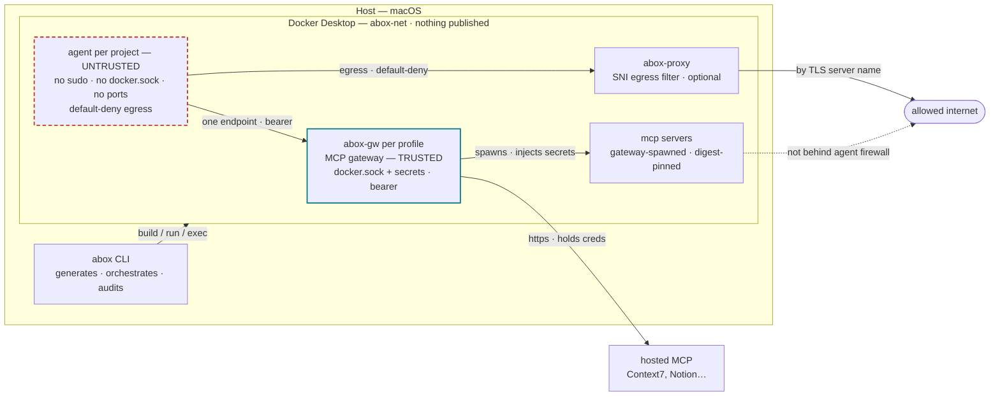

# abox

Disposable, network-restricted Claude Code environments — one per project, with
MCP access only through a Docker MCP Gateway.

abox treats the agent as untrusted. It executes model-influenced instructions,
including whatever arrives through files, tool output, and web content, so the
controls here limit blast radius on four axes: **filesystem**, **network
egress**, **credentials**, and **execution**.

## Invariants

These are enforced, not documented aspirations — `abox doctor` checks each one
against the machine, and `abox run` refuses `bypassPermissions` if any fails.

| Invariant | How it is enforced |
|---|---|
| The agent cannot reach the Docker daemon | no `docker.sock` mount in the rendered config; checked at every run |
| The agent publishes nothing | no `-p`, no `appPort`, no `forwardPorts` |
| Default-deny egress | in-container iptables + ipset; only addresses resolved from the allowlist, on 443 |
| Domain-level egress (optional) | SNI-aware proxy decides by the TLS server name, so a shared CDN address grants nothing |
| Exactly one MCP endpoint | `claude --mcp-config /opt/abox/mcp.json --strict-mcp-config`, bearer-authenticated |
| The agent cannot rewrite its own sandbox | the mounted artifacts live outside the workspace, read-only |
| The agent cannot escalate | `sudo` **purged** from the image (build fails if present); abox applies the firewall as root through the socket it already holds |
| Secrets never reach the agent | the Docker daemon injects them into MCP server containers; neither gateway nor agent holds a value |
| Hosted MCPs don't widen the sandbox | the gateway dials them, so the agent gets no new endpoint and no new egress |

## How it fits together



The same topology as text, with the exact mounts and ports:

```
Host (macOS)
├── Docker Desktop (MCP Toolkit)
│   ├── network: abox-net              user bridge, nothing published anywhere
│   ├── abox-gw-<profile>              docker/mcp-gateway@sha256:… (digest-pinned)
│   │     ├─ mounts /var/run/docker.sock
│   │     ├─ --transport=streaming --port=8811 --host=0.0.0.0
│   │     └─ bearer token, minted per profile by abox
│   ├── mcp/<server> containers        spawned by the gateway, digest-pinned
│   ├── abox-proxy-<project>           nginx, optional — SNI-filtered egress
│   └── agent-<project>                ephemeral devcontainer
│         RW  /workspace               the project bind
│         RO  /opt/abox                firewall script + mcp.json (agent cannot edit)
│         RO  /context/*               declared read-only context dirs
│         RO  masked paths             empty overlays over .env* and friends
│         VOL abox-claude-<hash>       ~/.claude, per project
└── abox (Python CLI)                  generates, orchestrates, audits
```

Agents reach `http://abox-gw-<profile>:8811/mcp` by container DNS. One gateway
serves every project on the same profile; abox tracks which projects need which
servers and reconciles the union.

## Install

Not on PyPI yet, so install from the checkout:

```bash
uv tool install --force ~/projects/abox
```

See **[QUICKSTART.md](QUICKSTART.md)** for the full from-scratch walkthrough,
including the Docker disk-size setting that trips up the first build. For the
complete reference — every setting, every hardening, and how to add each kind of
MCP server (catalog, hosted, and self-hosted custom images) — see
**[GUIDE.md](GUIDE.md)**.

Host prerequisites:

- **Docker Desktop ≥ 4.48** with the MCP Toolkit enabled — that is the whole list
- **`op`** (1Password CLI) — optional, only if you point a secret at `op://…`

**No npm, no Node, no `@devcontainers/cli` on the host.** abox drives the Docker
CLI itself and bakes Claude Code into the image from its checksum-verified
native binary. The only thing that ever installs Node is the `node` toolchain,
and that lands *inside the container* because your project asked for it.

## Quick start

```bash
cd ~/projects/demo-app
abox init          # pick MCP servers, toolchains, egress; writes agentbox.yaml
abox up            # network + gateway + image build (first build takes a few minutes)
abox shell         # once, to complete the Claude login (it persists in a volume)
abox run "summarise the open PRs in this repo"
abox doctor        # full audit, including what the agent tried to reach and could not
```

Skipping `abox shell` is the usual reason a first headless run exits 1: a fresh
project has an empty auth volume, so `claude -p` fails at authentication.

## The manifest

```yaml
version: 1
project: demo-app
profile: dev
servers: [github-official, duckduckgo]
remote_servers:                                       # hosted, proxied by the gateway
  context7:
    url: https://mcp.context7.com/mcp
tools:
  github-official: [list_issues, get_file_contents]   # optional narrowing
toolchains: [python, go]
mounts:
  mask: [".env*", ".git/hooks", "secrets/"]
  context: ["~/notes/dev"]                        # → /context/dev:ro
egress:
  - github.com
  - api.github.com
  - pypi.org
run:
  permission_mode: bypassPermissions   # refused unless every boundary check passes
  output: stream-json
```

The profile gateway and the hosts Claude Code needs to authenticate —
`api.anthropic.com`, `platform.claude.com`, `claude.ai`, `claude.com` — are
added automatically. Everything else is dropped, and every lookup, allowed or
not, is logged.

`platform.claude.com` is the one that bites: OAuth token *refresh* goes there
for both claude.ai and Console accounts, so without it a session that works
today fails whenever the token rolls over.

Claude Code also reaches for its auto-updater, telemetry, and claude.ai MCP
connectors. abox blocks those **and turns them off**, so the agent stops
retrying and the review queue keeps meaning something:

| Host | Why it is off | Switch |
|---|---|---|
| `downloads.claude.ai` | the image pins a version; updating inside a disposable container undoes that | `DISABLE_AUTOUPDATER=1` |
| Datadog intake hosts | optional operational telemetry | `CLAUDE_CODE_DISABLE_NONESSENTIAL_TRAFFIC=1` |
| `mcp-proxy.anthropic.com` | a second MCP path, which the single-endpoint invariant exists to prevent | `ENABLE_CLAUDEAI_MCP_SERVERS=false` |

Re-enable any of them in `agent_env` in the global config — and add the matching
domain to `defaults.egress_mandatory` if you do.

## Your existing MCP setup

abox starts a project with **nothing**. Your host's MCP servers and your
claude.ai connectors are deliberately absent until the manifest declares them —
that is the point, but it is also the first thing that surprises people.

```bash
abox mcp import          # what you have on this host, and what can come in
abox mcp import --apply  # declare the ones that can
```

```
context7           docker-mcp: catalog image server   already declared
github-official    docker-mcp: catalog image server   can be imported
playwright         docker-mcp: catalog image server   can be imported
notes              claude-code: local stdio (notes)   no — a host binary; running it
                                                      for the agent would mean mounting
                                                      it and its data into the sandbox
MCP_DOCKER         claude-code: the Docker MCP        no — abox already is this gateway
                   gateway in stdio mode                 — import its servers instead
```

Three cases, three answers:

- **Docker MCP Toolkit servers** — the same catalog abox uses. Import them and
  they run behind the gateway, fully logged. Secrets you already set with
  `docker mcp secret` are found automatically.
- **`MCP_DOCKER` itself** — that entry *is* `docker mcp gateway run` in stdio
  mode. abox replaces it rather than nesting inside it.
- **Local stdio servers** (a host binary like `notes`) — no clean path. Running
  one for the agent means mounting the binary and its data into the sandbox,
  which is a hole, not a feature. abox says so instead of doing it quietly.

### claude.ai connectors

Gmail, Drive, Notion, Linear and the rest of what your claude.ai account has
attached are **off by default**. They arrive over `mcp-proxy.anthropic.com` as a
second MCP path that abox does not mediate: those tool calls never appear in
`abox logs --gateway`, and their capabilities are not declared in your manifest.

Two ways to get them:

**Preferred** — many are in the Docker catalog as remote servers, which keeps
them behind the gateway:

```bash
abox mcp list --all | grep -i notion
abox mcp add notion && abox mcp oauth notion
```

**Or turn the claude.ai path on**, knowingly:

```yaml
run:
  connectors: true
```

That flips `ENABLE_CLAUDEAI_MCP_SERVERS`, allowlists the proxy, and drops
`--strict-mcp-config`. `abox doctor` stops claiming one endpoint and says what
you actually have. It requires a claude.ai subscription login — connectors are
not loaded for API-key auth.

## Remote / hosted MCP servers

Not every MCP server runs in a container. Context7, Notion, Asana, Atlassian,
Linear and ~75 others are internet-hosted, and abox reaches them **through the
gateway** rather than letting the agent dial out:

```
agent ──(one endpoint, bearer auth)──▶ abox-gw-<profile> ──(https)──▶ mcp.context7.com
        firewall never learns this host ─┘                 gateway holds any credential
```

That keeps every invariant intact. The agent gains a tool, not a network path.

**Servers already in the Docker catalog** — just name them:

```bash
abox mcp add asana          # type: remote in the catalog; nothing to pull
abox mcp oauth asana        # host-side OAuth; the token lands in the OS keychain
```

**Anything else, by URL:**

```bash
abox mcp add-remote context7 --url https://mcp.context7.com/mcp
abox mcp add-remote acme \
  --url https://mcp.acme.com/mcp \
  --secret acme.api_key=ACME_TOKEN \
  --header 'Authorization: Bearer ${ACME_TOKEN}'
abox up                     # regenerates the gateway's catalog and reconciles it
```

which lands in the manifest as:

```yaml
remote_servers:
  context7:
    url: https://mcp.context7.com/mcp
    transport: streamable-http
```

abox renders these into a Docker MCP v3 catalog, mounts it read-only into the
gateway, and passes `--additional-catalog`. `abox gateway status --tools` shows
what the agent actually sees:

```
abox-gw-dev — Docker AI MCP Gateway 2.0.1
  url: http://abox-gw-dev:8811/mcp
  servers: context7
  remote (proxied): context7
  tools (2): query-docs, resolve-library-id
```

`https` is required and `doctor` says the quiet part out loud: a remote server is
third-party operated, there is no digest to pin, and the operator of that
endpoint can change what its tools do at any time. Review them like dependencies.

## Egress: address-level by default, domain-level on request

By default the allowlist is enforced on **IP addresses**, because that is what
iptables and ipset match on. It blocks every address not resolved from the
allowlist, on every port except 443 (80 is opt-in via `egress_ports`), and
records every DNS lookup.

That has one limit worth understanding: **domains sharing an address are not
separable.** `pypi.org` and `files.pythonhosted.org` are both Fastly and resolve
to the same four IPs; all four Anthropic domains share one. Once an address is
allowed, a request carrying a different SNI or `Host` header reaches whatever
else lives there — domain fronting. `abox doctor` reports the overlaps it sees.

### The SNI proxy closes it

Turn on the egress proxy and the allowlist becomes **domain-level**:

```yaml
# ~/.config/abox/config.yaml
egress_proxy:
  enabled: true
```

The agent's firewall then stops allowlisting addresses entirely. It permits
exactly one destination — an nginx container on `abox-net` — and redirects every
outbound 443 connection there. nginx reads the server name from the TLS
ClientHello (`ssl_preread`), looks it up in a map rendered from your allowlist,
and connects onward or closes. Verified against the actual attack:

```
allowed https://example.com           → 200
allowed IP, SNI = pypi.org (fronting) → connection reset
allowed IP, no SNI, Host: pypi.org    → connection reset
```

Three things it does **not** do: it does not terminate TLS (no CA to install, no
certificate to trust, nothing inside the tunnel visible to abox — only the
destination name); it publishes nothing; and it runs read-only with every
capability dropped. Refusals are logged by SNI, and `abox doctor` surfaces them
as a stronger signal than the DNS queue — these names were *connected to*, not
merely resolved:

```
! connections refused by SNI: pypi.org
  ↳ these were connected to, not merely resolved — a stronger signal than the
    DNS queue. `abox egress add <domain>` to allow
```

**MCP tools remain uncovered either way.** They run in the gateway's containers,
which have no such firewall. A server like `curl` or `fetch` reaches past the
agent's egress by design; `abox doctor` names those servers explicitly.

**DNS is scoped too.** dnsmasq forwards only names the allowlist covers and
returns NXDOMAIN for everything else, which closes the covert channel where the
query name itself carries the data. The refused lookups are still logged, so the
review queue keeps working:

```
exfil name resolves : NO      dns.log records the attempt : 4 times
```

## Context cost

MCP tool schemas are re-sent on **every turn**, so a wide server is a standing
tax rather than a one-off. abox measures it from the live gateway, which means
the number reflects the `tools:` narrowing actually in effect:

```bash
abox mcp cost
```

```
tool                ~tokens
resolve-library-id      757
query-docs              454
fetch_content           422
search                  343

4 tools ≈ 1,977 tokens per turn
  no `tools:` narrowing declared — every tool each server offers is in
  context on every turn
```

Six servers with everything enabled runs to roughly 5,000 tokens a turn before
the agent has done anything. Narrowing is the biggest single lever abox gives
you, and it is declarative:

```bash
abox mcp add github-official --tool list_issues --tool get_file_contents
```

### Filtering command output

`rtk` filters verbose command output before the model sees it. Off by default,
because enabling it installs a `PreToolUse` hook — another program in the
agent's command path, which is a reasonable thing to want and a bad thing to do
silently:

```yaml
# ~/.config/abox/config.yaml
rtk:
  enabled: true
  version: "0.43.0"
```

abox then installs the checksum-verified Linux binary into the image — the same
discipline as the Claude Code binary — and renders a `settings.json` into the
read-only artifacts dir, passed with `claude --settings`. The agent cannot edit
the hooks that wrap its own commands.

## Secrets

There is no single required secret store. Point each secret at whatever source
you actually use:

```yaml
# ~/.config/abox/secrets.yaml
mappings:
  - secret: github.personal_access_token
    op: "op://abox/github-mcp/token"      # 1Password
  - secret: supabase.access_token
    file: "~/.config/abox/supabase.token" # a file, refused if group/world-readable
  - secret: brave.api_key
    env: BRAVE_API_KEY                    # a host env var
  - secret: some.token
    source: prompt                        # typed in, never written to disk by abox
  - secret: legacy.key
    source: docker                        # already in the store; abox only verifies it
```

```bash
abox secrets sync            # push every readable source into the Docker store
abox secrets set some.token  # one-off, prompted, never echoed
abox secrets check           # drift report; values are never printed
abox secrets ls              # who references what
```

`ls` is the reverse index — the blast radius, which is what you want before
rotating or revoking a credential:

```
secret                        store  source  used by
brave.api_key                 yes    -       alpha → server brave
demo.shared                   yes    stdin   alpha → env DATABASE_URL
                                             beta → env API_KEY
demo.solo                     yes    stdin   beta → remote acme
github.personal_access_token  yes    -       — nothing references it
```

It covers all three ways a secret gets consumed — handed to the agent as an env
var, required by a declared MCP server, injected into a remote server's headers
— across every project abox has bound to a profile. `--unused` lists credentials
sitting in your keychain for nothing. A project abox has never seen cannot
appear, and a registered project whose manifest has moved is reported explicitly
rather than silently dropped: incomplete blast radius is worse than none.

Values move over pipes, never over argv. abox records a **salted** digest for
drift detection — a bare `sha256` of a low-entropy secret is crackable offline,
and that file has the same blast radius as the secret it describes.

The gateway never holds a value either: it emits `-e VAR` with no value and the
Docker daemon resolves `se://docker/mcp/<name>` from the OS keychain when it
starts the MCP server container.

### Giving the agent a secret

Everything above routes *around* the agent. Sometimes the work itself needs a
credential — a database URL, a registry token — and then the agent must hold it:

```bash
abox secrets set some.token                    # store it (prompted, or --file/--env/--stdin)
abox secrets attach DATABASE_URL=some.token    # hand it to the agent
abox up
```

abox passes an `se://` reference the Docker daemon resolves at container start,
so the value never reaches abox's argv, `runspec.json`, or any file abox writes.

**This is the one place abox weakens its own invariant, and it says so on every
run:**

```
! the agent holds secrets in its environment: 1 secret(s): DATABASE_URL←some.token
  ↳ the agent can read, print, and transmit these to any allowed domain
    (4 currently allowed) — keep the egress list tight, and expect them in
    `docker inspect` on the agent container
```

Both halves of that are true and neither is fixable: a value the agent can read
is a value the agent can exfiltrate to anywhere the firewall allows, and a value
in a container's environment is visible to anyone with host Docker access. The
egress allowlist stops being defence-in-depth here and becomes the actual
boundary. `abox secrets detach DATABASE_URL` takes it back.

## Commands

| Command | What it does |
|---|---|
| `abox init` | interactive picker → `agentbox.yaml` + rendered artifacts; re-runs merge |
| `abox up` | network, gateway, artifacts, cached image build |
| `abox render` | re-render the generated artifacts from the manifest, without building or running |
| `abox run "<prompt>"` | fresh container, headless `claude -p`, transcript captured, container destroyed |
| `abox shell` | same sandbox, interactive tty (use this for the first login) |
| `abox mcp list/add/rm` | manage declared servers |
| `abox mcp add-remote/rm-remote` | declare an internet-hosted MCP server, proxied by the gateway |
| `abox mcp import` | inventory this host's MCP servers; `--apply` declares what can come in |
| `abox mcp cost` | per-turn token cost of the declared tool set |
| `abox mcp oauth [provider]` | list or authorize OAuth apps for hosted servers |
| `abox egress list/add/rm` | manage the allowlist; `list` also shows the review queue |
| `abox egress ignore/unignore` | record a decision *against* a domain so it leaves the queue |
| `abox secrets sync/check/set/ls` | secret plumbing |
| `abox secrets attach/detach` | hand a stored secret to the agent as an env var (weakens an invariant; doctor reports it) |
| `abox secrets rm` | revoke; refuses while a project still references it |
| `abox gateway up/down/status` | per-profile gateway lifecycle (`--tools` lists what it exposes) |
| `abox gateway update` | re-resolve the gateway tag to a digest and pin it, after showing the diff |
| `abox doctor` | the full audit |
| `abox logs --runs/--dns/--gateway` | local telemetry |
| `abox nuke` | remove containers and artifacts (prompts before the auth volume) |

## What `abox run` actually does

1. **Preflight.** Gateway healthy, artifacts match the manifest, no socket, no
   published ports, caps present. `bypassPermissions` turns every warning into a
   refusal.
2. **Provision.** `docker run` from the runspec in the state dir — not from any
   file in your repo, and not through an intermediate tool that could
   reinterpret a capability, a mount, or a network.
3. **Verify the firewall came up *inside* the container.** The script writes a
   marker into the bind-mounted log dir; no marker, no agent. A container whose
   `postStart` silently failed looks identical from the host to one where it
   worked, which is exactly why this check exists.
4. **Execute.** `claude -p … --output-format stream-json`, teed to
   `runs/<ts>-<id>.jsonl`.
5. **Harvest.** iptables counters, the dnsmasq log, session id, tool calls.
6. **Destroy** the container. The workspace and the auth volume persist.

## The egress review queue

dnsmasq is the container's only resolver, so every lookup is recorded —
including the ones the firewall then refuses to route. `abox doctor` diffs those
names against the allowlist and shows you what the agent wanted:

```
! egress review queue: 3 domain(s) looked up but not allowed:
    telemetry.example.com (x14), cdn.jsdelivr.net (x2), pastebin.com (x1)
  ↳ promote deliberately with `abox egress add <domain>`
```

That list is the most useful artifact this design produces. `pastebin.com`
showing up after a run is a fact you want, and you only get it because the
lookups that went nowhere were still logged.

It stays useful only while it means *undecided*, so a domain you have ruled
against gets recorded rather than re-listed:

```bash
abox egress add api.example.com        # allow it
abox egress ignore telemetry.vendor.io # still blocked, no longer asked about
```

**MCP tools are not covered by this.** They run in the gateway's own server
containers, so a server like `curl` or `filesystem` reaches past the agent's
firewall and masks by design. `abox doctor` names those servers explicitly
rather than letting the sandbox look tighter than it is.

## State on disk

```
~/.config/abox/
  config.yaml            network, gateway image, profiles, defaults
  secrets.yaml           source → docker secret name (references, never values)
  custom-servers.yaml    servers outside the Docker catalog (digest-pinned)

~/.local/state/abox/
  gateways/<profile>.{token,json,fingerprint}
  secrets.json           salted digests for drift detection
  <project-hash>/
    artifacts/           runspec.json (the literal docker argv), Dockerfile,
                         init-firewall.sh, mcp.json (mounted read-only)
    runs/                one JSONL transcript per run
    runs.jsonl           run index
    dns-queries.jsonl    every name the agent looked up
    fw-counters.json     what the firewall dropped
    git-snapshot.json    baseline for the git tamper check
```

**`/workspace` is a read-write bind of your real project directory.** Anything
the agent writes there lands on the host filesystem — that is the point of a
coding sandbox, but it is not a copy. The masks shadow specific paths; they do
not make the workspace immutable. If you want the agent unable to touch your
files at all, that is a different tool.

**The audit trail is not writable by the agent.** `/var/log/abox` is root-owned
inside the container and deliberately *not* bind-mounted: Docker Desktop does not
enforce uid or mode on bind mounts, so a shared log directory would let the agent
truncate `dns.log` and with it the egress review queue. abox harvests the logs
through the Docker socket at teardown instead.

`.devcontainer/` in your repo is a **review copy** — readable, diffable,
committable, and enough for an editor to open the same image. abox never reads
it back: it runs `runspec.json` from the state dir, so an agent that rewrites the
firewall script in the workspace changes nothing except a `doctor` finding.

## Development

```bash
uv sync
uv run pytest                  # hermetic; docker-dependent tests deselected
uv run pytest -m docker        # the ones that need a live daemon
uv run ruff check src tests
```

## Deviations from the original plan

Recorded because each was a deliberate choice made against a verified fact, not
an oversight:

- **Gateway auth.** The plan left `/mcp` open on the bridge. Docker's gateway
  requires a bearer token on TCP transports, so abox mints one per profile and
  hands it to the agent — anything else on `abox-net` gets a 401.
- **Catalog source.** `docker mcp catalog ls` does not exist. abox reads the
  local v3 catalog at `~/.docker/mcp/catalogs/*.yaml`, whose keys are exactly
  the names `--servers` accepts, and falls back to `docker mcp catalog show`.
- **Server images are pre-pulled.** The gateway spawns servers with
  `--pull never`; without a pre-pull the first tool call dies deep in a log.
- **A Dockerfile, not a bare image.** Firewall tooling and toolchains are baked
  into cached layers instead of `apt-get`-ed on every disposable run.
- **No devcontainer CLI at all.** The plan made `@devcontainers/cli` a host
  prerequisite; abox drives `docker build` / `docker run` / `docker exec`
  directly instead, which keeps npm off the host, makes the exact argv auditable
  (`runspec.json`), and restores the plan's own `agent-<project>-<runid>`
  container naming that the CLI would have overridden.
- **Claude Code from its native binary.** Fetched from the same URL and verified
  against the same published sha256 as the official installer, then placed in
  `/usr/local/bin` — where the `~/.claude` volume cannot shadow it.
- **No sudo in the image at all.** The plan narrowed sudo to the firewall
  script. abox holds the Docker socket, so it runs that script as root itself
  and the binary is purged rather than defanged — a present-but-neutered setuid
  binary is one config mistake away from working again. The build asserts its
  absence and fails if it is there.
- **Artifacts live outside the workspace.** See above — the plan mounted the
  agent-writable copy.
- **Secrets are pluggable.** 1Password is one source among file, env, prompt,
  and "already in the store".
- **Containers are labelled, not custom-named.** The devcontainer CLI names its
  own containers; abox finds them by `--id-label abox.run=<id>`.
- **Hosted MCPs are proxied, not dialled.** The plan assumed every MCP server
  was a container. Remote servers go through the gateway instead of into the
  agent's `.mcp.json`, so "exactly one MCP endpoint" survives contact with
  Context7 and friends.
- **The gateway image ships digest-pinned, resolved by pulling.** The plan left
  it on the `:v2` tag. It is the one container that mounts `docker.sock`, so it
  is now pinned like everything else, and `abox gateway update` re-resolves the
  tag by pulling it and reading the daemon's own `RepoDigests` rather than by
  asking a registry — the digest abox writes is then the one the daemon actually
  holds, with no second resolution path to trust. Verified arch-independent:
  `docker buildx imagetools inspect docker/mcp-gateway:v2` returns the same
  manifest-list digest that a local pull records.
